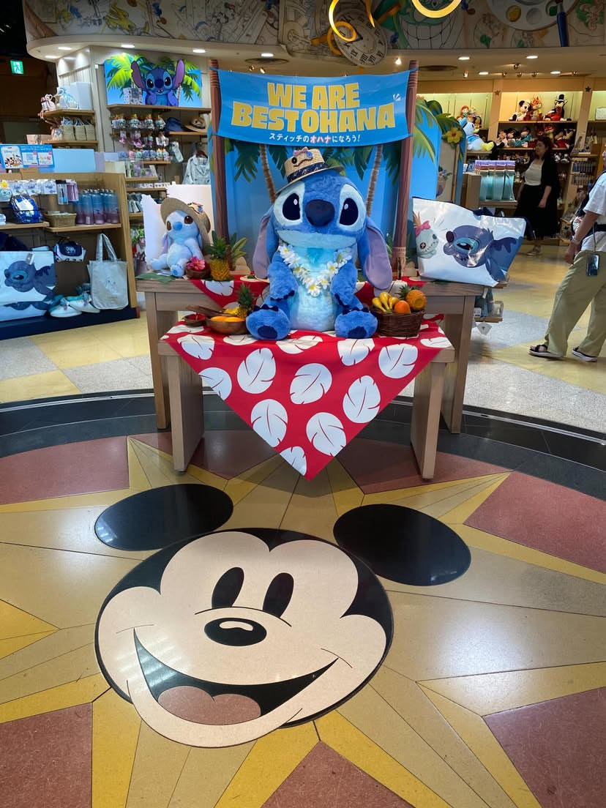
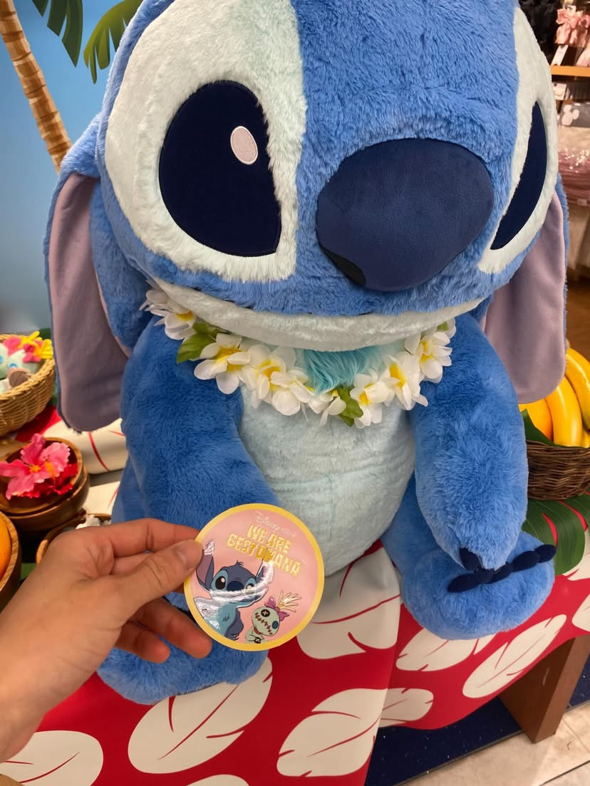

<!DOCTYPE html>
<html lang="ja">
<head>
  <meta charset="UTF-8" />
  <title>2025年7月28日 - おでかけ〜♪</title>
  <link rel="stylesheet" href="../style.css" />

  
</head>
<body oncontextmenu="return false;" onselectstart="return false;" ondragstart="return false;">
  <header>
    <h1>HIKARI・HIKARU 日々のブログ</h1>
  </header>

  <main>
    <h2>2025年7月28日 - おでかけ〜♪</h2>
    

      少し前に久しぶりにおでかけしました✨ 
      その時の写真です...（笑）  
      以上！  
      そんな感じです。笑
    

    <!-- 横並び画像 -->
    

      <!-- image0 -->
      

        
        
© HIKARI-HIKARU 2025

      

      <!-- image1 -->
      

        
        
© HIKARI-HIKARU 2025

      

    

  </main>

  

  
</body>
</html>
